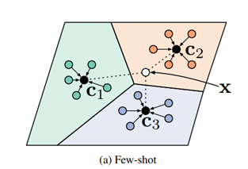

# Fewshot_Omniglot

## Problem

Few-shot image classification is a task of classifying images into different classes when there is only a limited number of training examples available for each class.

**Input**: The input consists of multiple tasks, each task containing three parts:

- Support set: This is a set of training images used to train the few-shot model. The training data typically includes a small number of examples from each class or category. For example, in the task of classifying alphabets, each alphabet may have only a few sample images.

- Query set: This is a set of images that we want to classify based on the trained few-shot model. The test data usually contains new images that the model has not seen during training.

- Class labels: For each image in the training data, corresponding class labels are provided to indicate which class they belong to. Class labels help the model learn how to accurately classify images into their respective classes.

**Output**: The output is the classification of images in the query set into their respective classes for each task.

## Methods

### Prototypical Network

[Prototypical network](https://arxiv.org/abs/1703.05175) is a model architecture in the field of few-shot learning, introduced by Jake Snell, Kevin Swersky and Richard S. Zemel in 2017.

### MAML

[Model-Agnostic Meta-Learning (MAML)](https://arxiv.org/abs/1703.03400) is a method in the field of meta-learning, introduced by Chelsea Finn, Pieter Abbeel and Sergey Levine in 2017.

## Experiment

### Dataset

The [OmniGlot](https://github.com/brendenlake/omniglot) dataset is a popular dataset used in machine learning, especially in few-shot learning and meta-learning problems. It was introduced by Lake and colleagues in 2015.

### Train

Both ProtoNet and MAML models are trained with 2000 iterations, each iteration has a batch size of 16. The dataset will be randomized during training.

The purpose of choosing 2000 iterations is because of computer hardware limitations, compared to the article in MAML, 60000 iterations is a small number but the results are positive.

The size of the support set is 5N3K (5 classes, 3 examples each) and 5N1K (5 classes, 1 example each), the query set will include 15 test shots for each class.

### Test

After training, both models will be evaluated on the first 500 non-randomized iterations to ensure fairness in the evaluation, each iteration has a batch size of 16.

The reason for choosing 500 iterations is because when selecting in order, it is possible to select all the characters in the test set (423 characters).

**Average accuracy results per iteration**

## Demo

